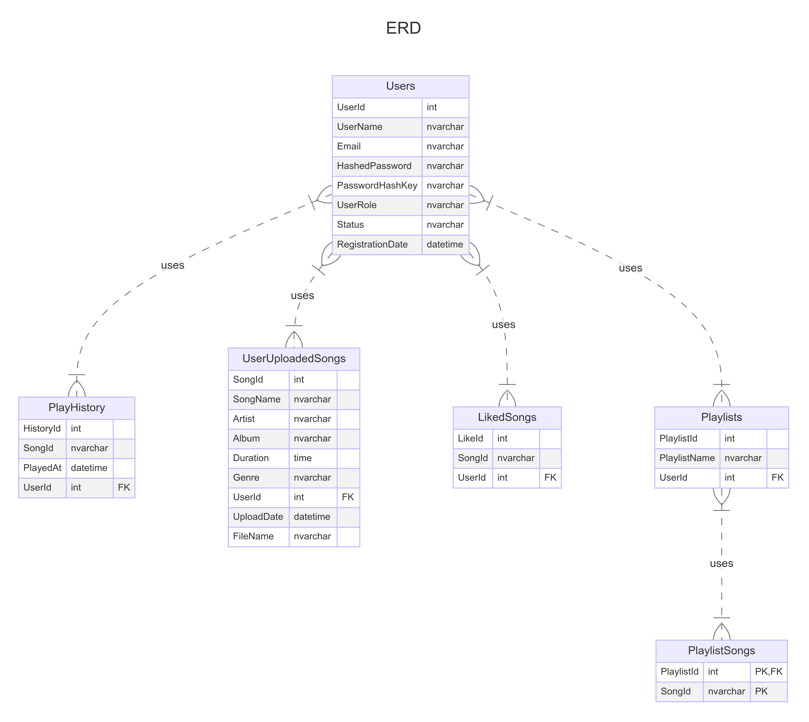

# Requirements Document for Music Application (SWAR)

## Project Overview
This project aims to develop a music application. The application will include features such as account creation, user login, playing songs, uploading songs (with a limit), creating playlists, and liking songs.

## Functional Requirements

### 1. User Management
#### 1.1 Account Creation
- Users should be able to create an account using their email and a password.

#### 1.2 User Login
- Users should be able to log in using their email/username and password.
- Implement JWT for authentication.

### 1.3 Admin Management
- Admins should be able to create, update, and delete user accounts.
- Admins should be able to deactivate user accounts.
- Admins should be able to manage uploaded songs.

### 2. Song Management
#### 2.1 Playing Songs
- Users should be able to play songs.
- Provide basic playback controls: play, pause, next, previous, and seek.

#### 2.2 Uploading Songs
- Users should be able to upload songs.
- Limit the number of songs each user can upload up to 10 songs.

### 3. Playlist Management
#### 3.1 Creating Playlists
- Users should be able to create, edit, and delete playlists.
- Users should be able to add and remove songs from their playlists.
- Limit the number of playlists each user can create to 3 playlists.
- Limit the number of songs in each playlist to 5 songs.

#### 3.2 Liking Songs
- Users should be able to like songs.
- Maintain a list of liked songs for each user.

## Technical Requirements

### 1. Technology Stack
- Backend: .NET Web API
- Frontend: HTML, CSS, JS
- Database: SQL Server 
- Authentication: JWT

### 2. Integration
- Integrate with a third-party API to fetch songs.
- Provide RESTful API endpoints for all functionalities.

### 3. Deployment
- Deploy the application on Azure.
- Use CI/CD pipeline for automated testing and deployment.

### 4. Testing
- Implement unit tests for all business logic.

### 5. ERD Diagram

